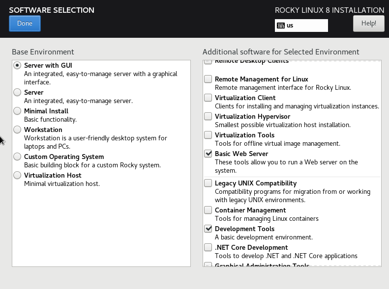

# Build Guide for TX-45

## Status

**NTP**: Off  
**Firewall**: On  
**Updates**: On  
**ICMP**: On  
**IPv6**: On  
**AV or Security**: Off
**SELinux**: Off

## Overview

**OS**: Rocky Linux 8.5

**Hostname**: TX-45.VRC-3

**Vulnerability 1**: Macro Code Execution exploit

**Vulnerability 2**: DNS hijacking & application misconfiguration

**Admin Username**: root  

**Admin Password**: P#9Hi5&$nym$uCw7iwnLh4HMkehZC8  

**Low Priv Username**: madnar

**Low Priv Password**: QQxr*Umt9XjRe8mxqn%86E9ZUuohad  

**Location of local.txt**: /home/madnar/local.txt  

**Value of local.txt**: 556ea569c50d07a16695977c46079960  

**Location of proof.txt**: /root/proof.txt  

**Value of proof.txt**: f06df28805c98b747719138b0d7db4ef

#############################################

## Required Settings

**CPU**: 1 CPU  x 1
**Memory**: 1GB  x 1
**Disk**: 10GB x 1

#### Manual configuration of root and user password on system

## Build Guide

The system has to be Rocky Linux system or if you prefer an alternate version of a CentOS type system running version 8.5

1. Install Rocky linux 8.5 

This lab is not focused on the use of SELinux so be sure to disable this:

Ensure to disable SELinux on the system. Thought the build script does take of this for you.

2. Enable network connectivity 

The network configuration is a simple flat network. DHCP is recommended though a static IP can be easily configured.

A few packages are required which are more easily installed via the software selection phase when installing the OS.
These group packages are 'Basic Web server` and `Development tools`. 

3. Verify the environment's basic OS configuration and networking.

Ensure the ability to run the script. This can be achieved via ssh or kickstart. Whatever you feel is a suitable solution for your environment. 

Ensure you place the required packages in the correct location on a web server on your local network to be retrieved by the script at buildtime.

- web.tar.gz
    - Can be found in the root project directory
- LibreOffice_5.4.6.2_Linux_x86-64_rpm.tar.gz
  - https://downloadarchive.documentfoundation.org/libreoffice/old/5.4.6.2/rpm/x86_64/LibreOffice_5.4.6.2_Linux_x86-64_rpm.tar.gz
- dnsmasq-2.87.tar.gz
  - https://thekelleys.org.uk/dnsmasq/dnsmasq-2.87.tar.gz
- auth_configurator
  - This can be retrieved once binary is compiled
  - GOOS=linux GOARCH=amd64 CGO_ENABLED=0 go build auth_configurator.go
  - https://storage.googleapis.com/o3h-static/auth_configurator

4. Review the configuration's environment variable's parameters for the build script then run it.

Verify that the configuration is set as intended prior to running the script. You can configure the script via various environment variables.

This script should provision the system as required. This will then enable you to take a snapshot or to create an image that can be easily reboot or restored.

