# TX-45 Walk through

## Enumeration

Once we have performed a basic port scan against the system. We find that there is a number of services running on the host. 
One of the key services is nfs on port 2049 and what appears to be a web server. 

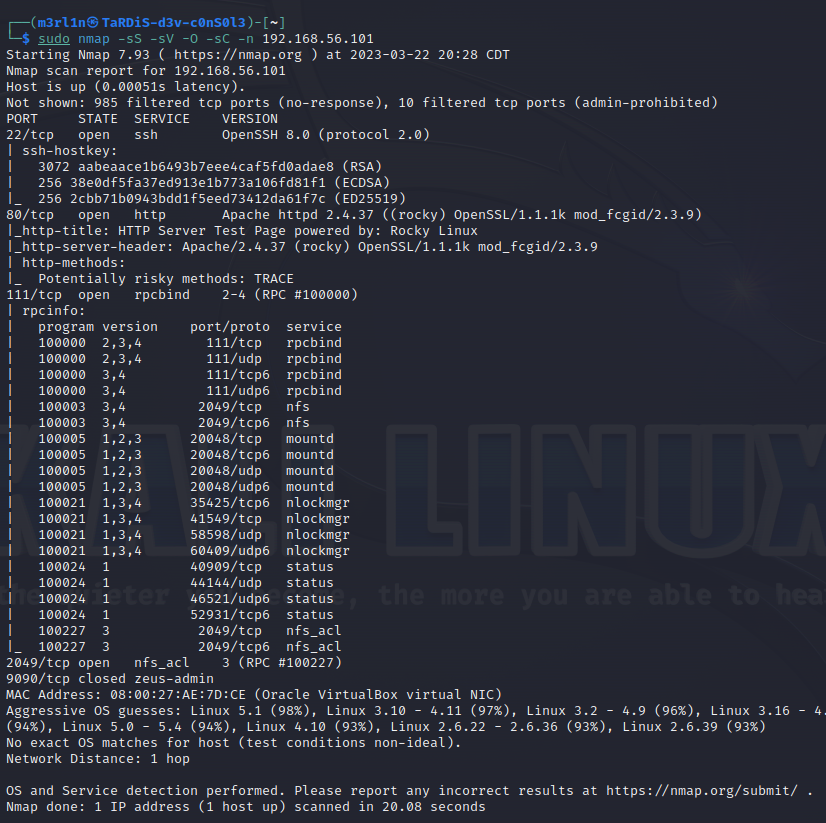

While performing enumeration we connect to the NFS port to find nothing there. There is only a list of avalible mounts. 

```sh
┌──(m3rl1n㉿TaRDiS-d3v-c0nS0l3)-[/var/www/html]
└─$ showmount -e 192.168.56.101    
Export list for 192.168.56.101:
/srv/nfs/support *
```

When enumerating the server by performing directory scanning we find that an admin area exists on the web server. 
The admin area does not seem protected.

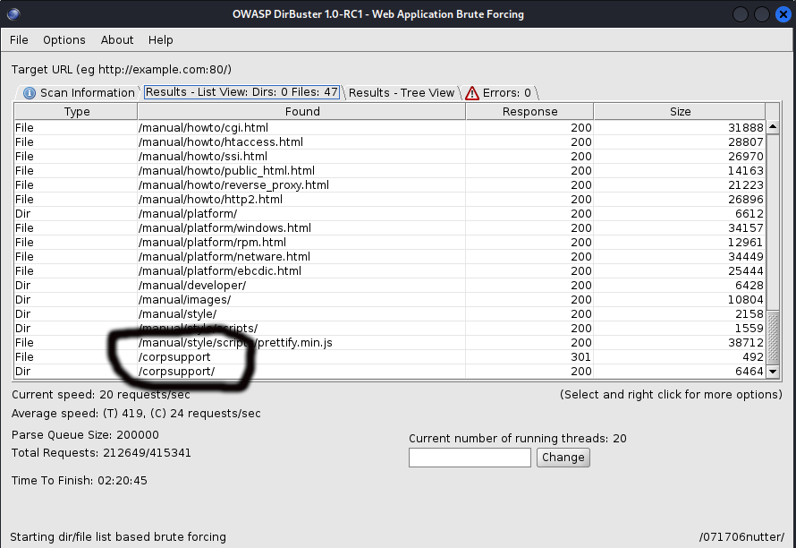

Through further inspection of this directory we find an admin page.

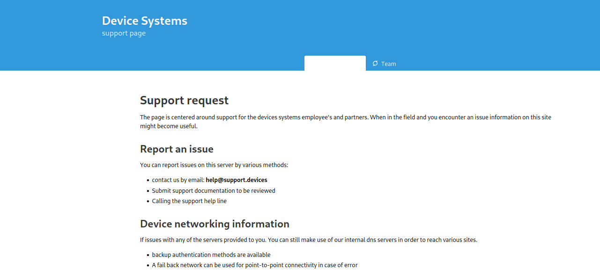

Inspecting the default index page on this system we see the following information available. 

- Submit support request's relating to product issues
- NFS information
- General company ethos
- Possible application version number

Through this information we are able to continue enumerating with insights. Understanding some of the purpose
of the systems design. Through some enumeration we find that the NFS service seems patched pretty well. Thus, another method is required to continue exploitation of this system. 

By inspecting the admin page once again we find that document's can also be submitted through the NFS service.
Though we don't have a solid understanding of the application that is used to review documents. We do however have the ability to take a random guess
based on the information found on  the admin page.

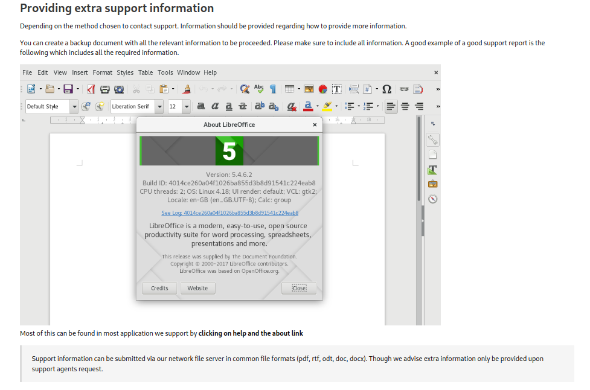

Version information is listed though we can not be certain of the exact version number or application in use. 
We can guess that this system is running version `LibreOffice 5.4.6.2` on a `linux 4.18 kernel`. 

Through searching the web we find a possible exploit we can use and lucky for us, it seems to be avalible within metasploit.

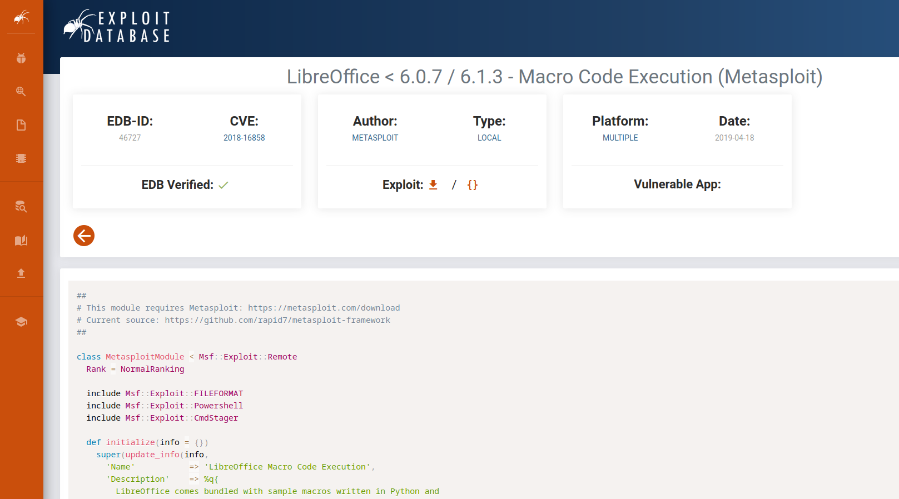


## Exploitation

In order to exploit this system we begin by reviewing all the information gathered from the enumeration phase.

The key bit of information that's needed in order to try to identify possible paths to exploiting the system was the version number.


We don't find much but one or two exploits. There seems to be a metasploit module for this. 

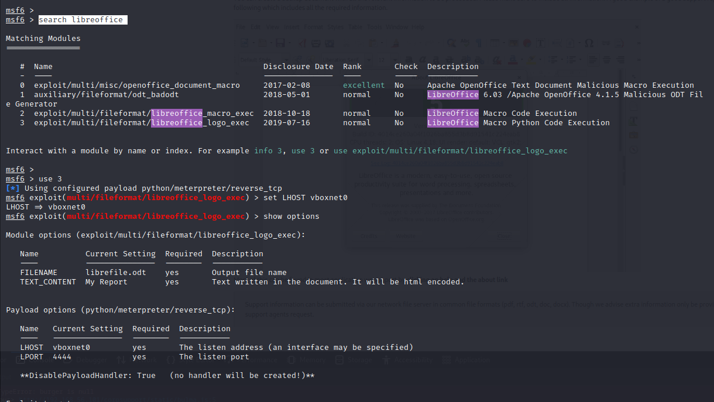


The metasploit module seems to generate a malicious document. Through the use of macro's it will then run a python script when executed on a remote system. 

The python script can be used to spawn a shell to your local system. 

We prepare our document with the default setting by running `exploit` to generate the malicious document. Once that is completed
we proceed to start the payload handler separately. 

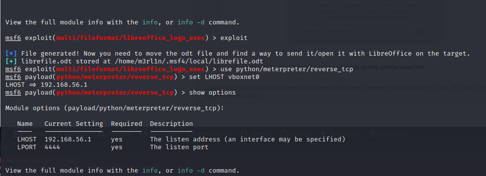


Once the document has been crafted with the correct local host information. We need to submit the document to the NFS server in the hopes that it can be processed accordingly.

Through mounting the remote NFS export to our system. We are able to proceed with copying our document over to the remote system.

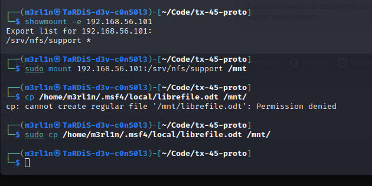


Hopefully upon submitting this documente we get a shell to the remote system based on our chosen payload. 


Once we have a payload we can proceed to enumerate the system in order to escalate privileges as needed.

Their various ways to improve the user experience when working on a shell without a `tty`. It is possible to use `bash -i` or you can also use metasploit psuode shell module.

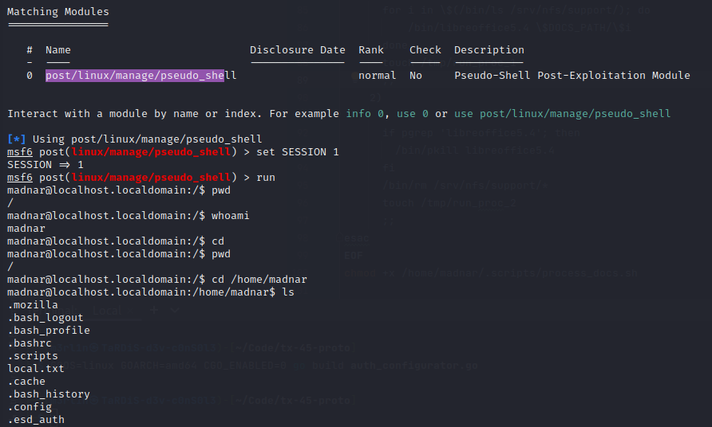

It is also possible to echo public key into the local user account in order to enable ssh access.

`echo "ssh-ed25519 AAAAC3NzaC1lZDI1NTE5AAAAIAWLQBFUQzKPT9T6W0oM6RFtMbEt8VS1emYjhkHRdo+H madnar@local" > /home/madnar/.ssh/authorized_keys`

Once this is done you can just simply SSH on the machine. Though ensure you have the permission set to `0600` or `0640` on the `authorized_keys` file via chmod. 

## Escalation

The system can be exploited by first running a number of different tool's to identify misconfigurations on the system.

Since we have the port `2049` open for NFS on the system we can easily transfer files to the remote system to perform further enumeration. 

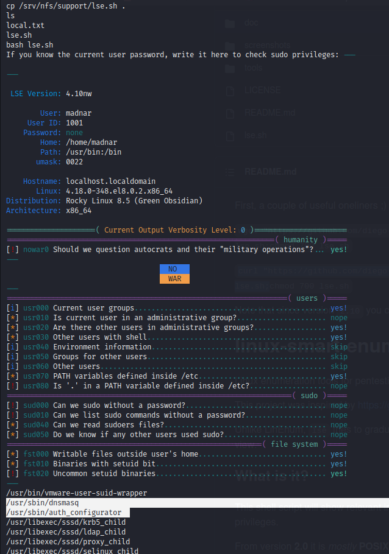


We identify a number of important things including what appears to be a set-uid binary. 
There appears to be two set-uid binaries on the system which can be useful when attempting to escalate privileges on the system.

One binary seems to be set to run based on a cron tab on the system and the other seems to have set-uid bit configured, though this does not mean its actively used as a service. 

Inspecting the system further we find an `/etc/resolv.conf` file. This file seems to have a non-standard DNS configuration.

We proceed by inspecting the set-uid binaries. We find a few interesting things. Their multiple ways to approach this.
Though on the system using `strace` we can see the DNS requests it's attempting to make. We also find a crontab file that has information regarding the command line parameters the application accepts.
It seems to be in the format `auth_configurator <username/target folder>`.

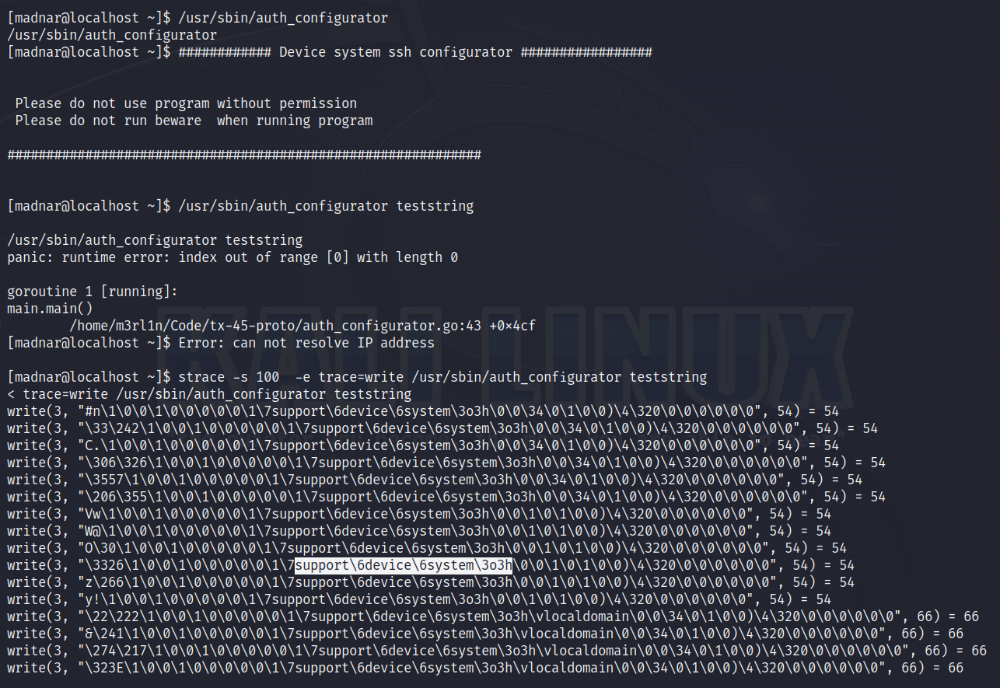

It is also possible to see the same thing when using scp copy in order to transfer the file to your local system for analysis.

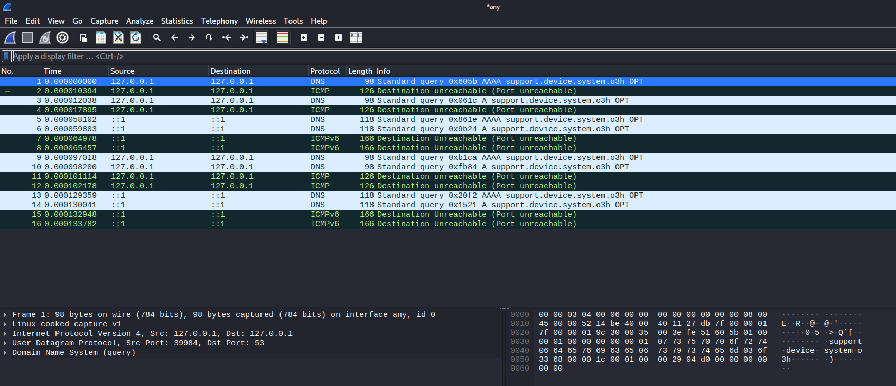

Looking also further at the system we find a loop back interface and a non-standard `/etc/resolv.conf` file. Inspecting the `resolv.conf` it seems to have what appears to be a 
non standardized DNS server address with a custom port. Inspecting the ports list via netstat we find that no service is listening on that port. This is common in environments where
tools are required for fail over purposes.

Knowing that `dnsmasq` is avalible on the system with the set-uid bit set. It is possible to proceed to create a fake DNS service.
This will enable us to hijack the request.

Through the use of `dnsmasq` we configure a service that can be set to listen to requests on the loopback interface based on the DNS request.
We configure a hosts file and port that can be used to serve AAAA records. We set the DNS record to our local kali instance. 

By attempting to a run a dig query we can ensure our request will be serviced as needed, so we verify our requests worked. 

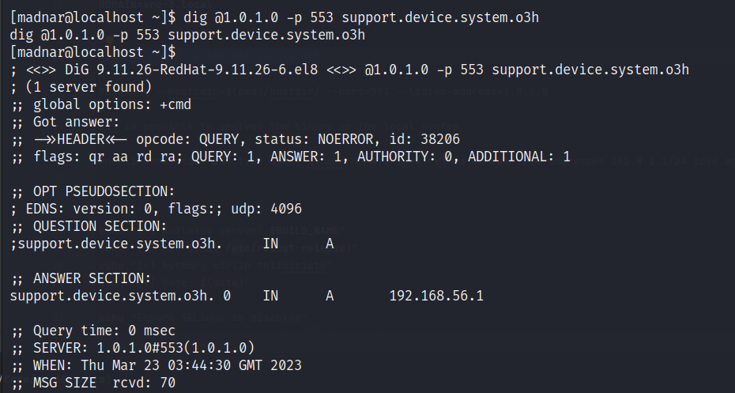

`dnsmasq --hostsdir=$(pwd)/hostdir/ --port=553 --listen-address=1.0.1.0`

Once this step is complete we can run our application again.

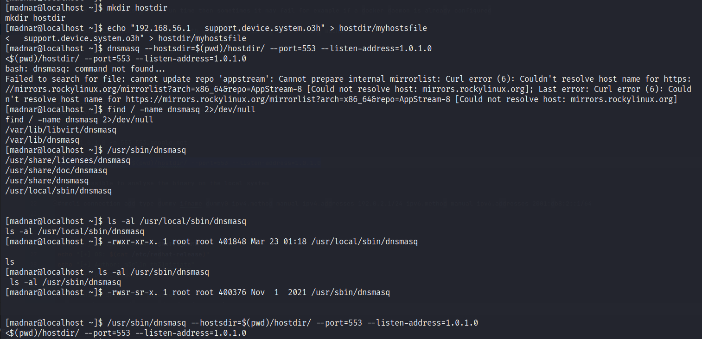

We seem to a get a request to our kali instance. The request seems to be for a file. The name of the requested file seems to suggest it contains an ssh key for an account.

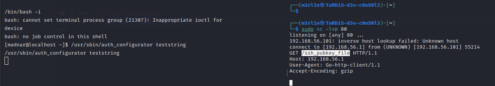

The binary seems to be attempting to retrieve what appears to be a public key to enable ssh. We can further test this also by using `tmp` to find out if anything is written to disk.

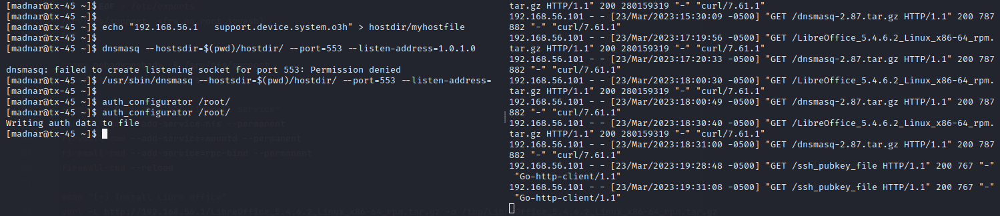

By placing our ssh public key on our web server we wait to see if a request comes through. We find that we receive a second request. If the files get a status code `200` we understand that it's ok to check and verify that authentication worked.

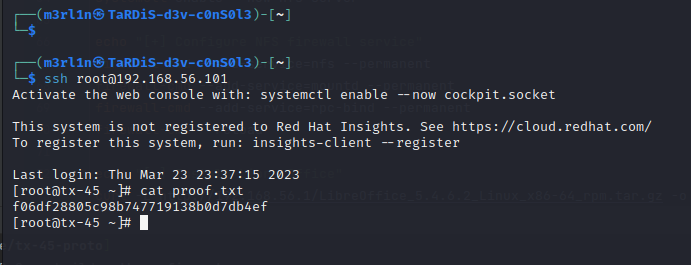

We try login via the root account to find that authentication seems to be successful.

It is then possible to access the root token. We find that this then completes the privilege escalation process.